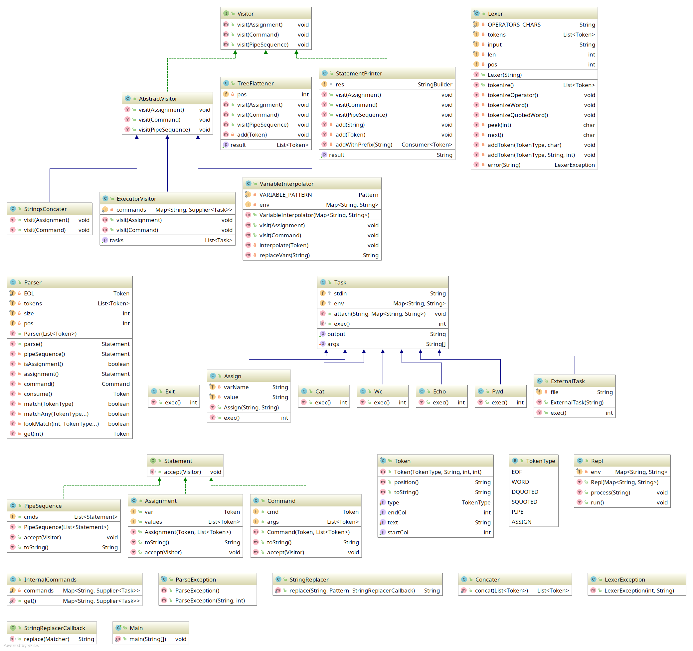

### Program flow


При старте программы запускается REPL, который в цикле принимает от пользователя строку. Эта строка передаётся в парсер, который возвращает AST. Дерево модифицируется серией визиторов: интерполятор переменных, визитор объединяющий строки `abc"x"'t'` → `abcxt`. Когда строчка готова, то запускается визитор-executor, который в зависимости от команды (cd, ls, etc) выполняет операцию, делегируя её одному из классов `tasks.commands.*`. Результат выводится на экран.

##### Диаграмма классов




### Поддерживаемые команды (из требований)

1. cat [FILE] — вывести на экран содержимое файла
2. echo — вывести на экран свой аргумент (или аргументы)
3. wc [FILE] — вывести количество строк, слов и байт в файле
4. pwd — распечатать текущую директорию
5. exit — выйти из интерпретатора
6. имя=значение

Функциональность:

* Одинарные и двойные кавычки
* Окружение (набор переменных)
* Оператор $ (подстановка переменной)
* Пайплайны (перенаправление ввода-вывода)

Примеры:

```bash
$ echo "Hello, world!"
Hello, world!
$ FILE=example.txt
$ cat $FILE
Some example text
$ cat example.txt | wc
1 3 18
$ echo 123 | wc
1 1 3
$ x=exit
$ $x
```

### Требования

* Комментарии в коде к классам, интерфейсам и public-методам.
* Юнит тесты для всех требований
* java-doc комментарий в package-info.java
* Команды должны добавляться легко

- архитектурное описание (диаграмма с классами и их взаимосвязями, немного текста, описывающего детали реализации)
- работающий интерпретатор
- несколько команд
- работающие кавычки и переменные окружения
- юнит-тесты, комментарии в коде

Всё это — в пуллреквест на гитхабе в свой репозиторий из отдельной ветки.